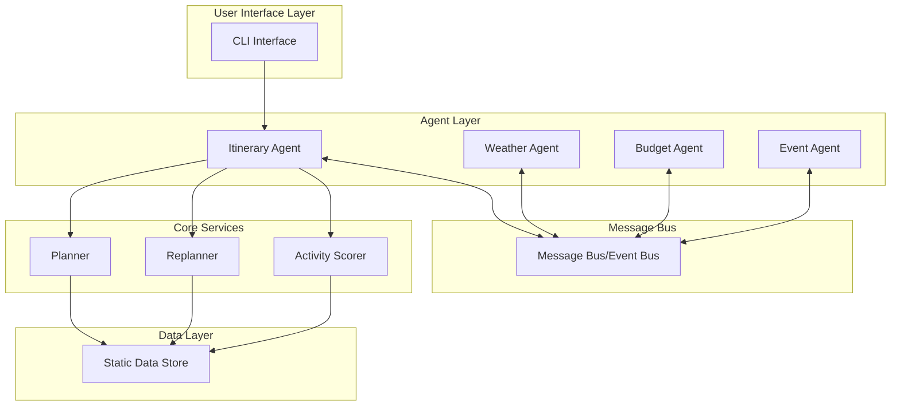

# System Architecture

## Overview

The Travel Planning System is a multi-agent system designed to create and dynamically adjust travel itineraries based on budget constraints, weather conditions, and external events.

## Architecture Diagram

## Component Description

### 1. User Interface Layer
- **CLI Interface**: Command-line interface for user interactions
- Handles input validation and formatting
- Presents itinerary results and status updates

### 2. Agent Layer
- **Itinerary Agent**: 
  - Central coordinator for itinerary management
  - Handles initial planning and replanning requests
  - Coordinates with other agents via message bus

- **Weather Agent**:
  - Monitors weather conditions
  - Triggers indoor activity replacements when needed
  - Notifies system of weather-related travel impacts

- **Budget Agent**:
  - Tracks budget allocation and spending
  - Validates cost changes during replanning
  - Suggests budget-optimized alternatives

- **Event Agent**:
  - Monitors external events (flight delays, closures)
  - Initiates replanning when needed
  - Provides event details to guide replanning

### 3. Message Bus
- Asynchronous pub/sub communication system
- Enables loose coupling between agents
- Supports dynamic message routing and filtering
- Maintains message delivery guarantees

### 4. Core Services

- **Planner**:
  - Handles initial itinerary creation
  - Implements budget-based optimization
  - Manages transport and accommodation selection

- **Replanner**:
  - Handles itinerary adjustments
  - Implements delay compensation strategies
  - Preserves feasibility during changes

- **Activity Scorer**:
  - Scores activity replacements
  - Implements similarity metrics
  - Optimizes for value and preferences

### 5. Data Layer
- Static data store for prototype
- Contains transport, accommodation, and activity options
- Supports future expansion to external APIs

## Key Design Principles

1. **Loose Coupling**: Agents communicate via message bus, reducing direct dependencies

2. **Single Responsibility**: Each component has a clear, focused purpose
   - Planner: Initial planning
   - Replanner: Handling changes
   - Activity Scorer: Optimization logic

3. **Open/Closed**: System is open for extension
   - New agents can be added without modifying existing ones
   - Message bus enables easy integration

4. **Fail-Fast**: Early validation and clear error handling
   - Input validation at CLI layer
   - Budget validation before changes
   - Explicit error states and messages

5. **Observable**: Comprehensive logging and tracing
   - Agent interactions are tracked
   - Planning decisions are logged
   - Error states are captured

## Technical Implementation

1. **Language & Framework**:
   - Python 3.x for implementation
   - Built-in unittest for testing
   - Type hints for better maintainability

2. **Key Data Structures**:
   - Dict for flexible data representation
   - Lists for activity collections
   - Strong typing via TypedDict (future)

3. **Communication Patterns**:
   - Pub/Sub for agent communication
   - Synchronous calls for core services
   - Asynchronous event handling

4. **Error Handling**:
   - Exception hierarchy for different error types
   - Graceful degradation in replanning
   - Clear error messages for users

## Future Extensibility

1. **External Services Integration**:
   - Weather API integration
   - Real flight data
   - Hotel booking systems

2. **Scale Considerations**:
   - Distributed message bus
   - Caching layer for optimization
   - Horizontal agent scaling

3. **Enhanced Features**:
   - Machine learning for predictions
   - User preference learning
   - Real-time monitoring and alerts