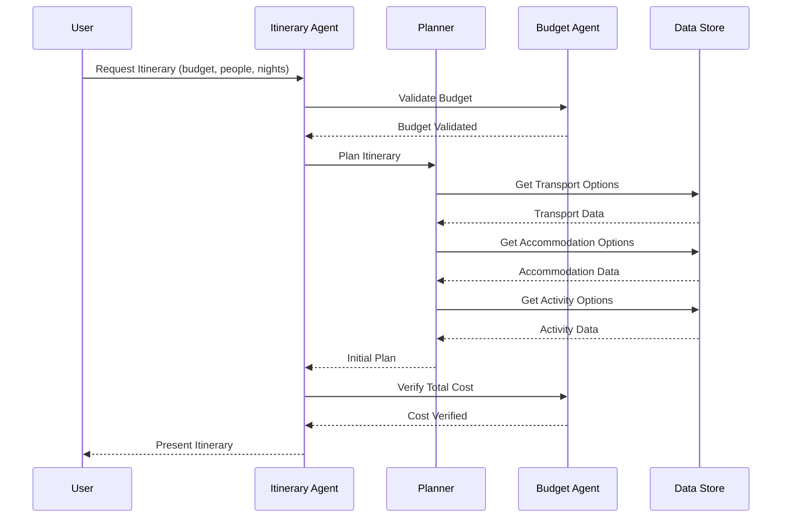
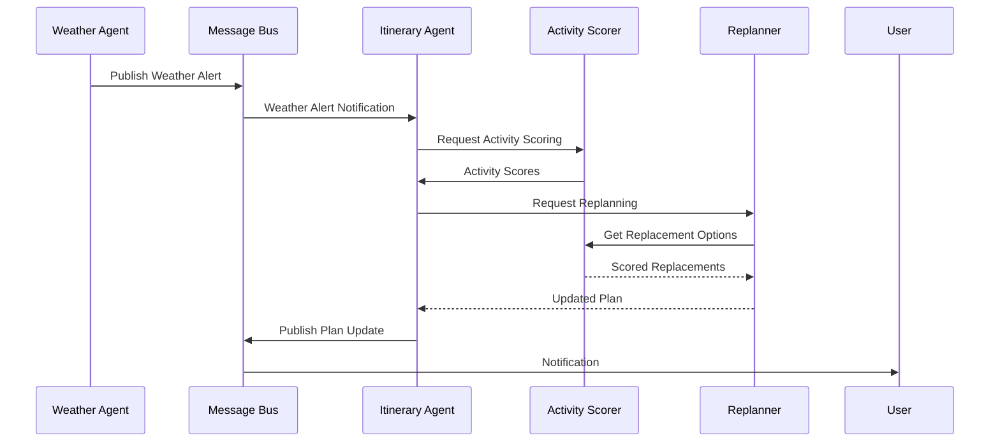

# Use Case Analysis

## Simple Use Case: Budget-Based Itinerary Planning

### Flow Diagram

### Description

1. **Initial Request**
   - User provides budget, number of people, and nights
   - System validates input parameters

2. **Budget Validation**
   - Budget Agent checks minimum feasibility
   - Validates per-person and per-night constraints

3. **Resource Selection**
   - Planner queries available options
   - Applies budget allocation heuristics
   - Optimizes for value within constraints

4. **Plan Creation**
   - Transport selection (40% budget)
   - Accommodation selection (40% budget)
   - Activity selection (20% budget)

5. **Verification**
   - Budget Agent verifies total costs
   - Confirms plan feasibility

6. **Response**
   - Returns complete itinerary
   - Includes cost breakdown
   - Indicates feasibility status

## Advanced Use Case: Weather-Triggered Replanning

### Flow Diagram

### Description

1. **Weather Monitoring**
   - Weather Agent detects poor conditions
   - Alert published to Message Bus
   - Affected activities identified

2. **Impact Analysis**
   - Itinerary Agent receives alert
   - Determines affected timeframes
   - Identifies activities needing changes

3. **Replacement Scoring**
   - Activity Scorer evaluates options
   - Considers:
     - Indoor/outdoor status
     - Cost constraints
     - Activity similarity
     - Value optimization

4. **Plan Adjustment**
   - Replanner generates alternatives
   - Maintains budget constraints
   - Preserves schedule feasibility
   - Optimizes for minimal disruption

5. **User Notification**
   - Changes communicated to user
   - Explains weather impact
   - Shows cost implications
   - Presents alternative activities

### Success Criteria

1. **Simple Use Case**
   - Plan within budget
   - Reasonable cost allocation
   - Maximum value activities
   - Fast execution (<1s)

2. **Advanced Use Case**
   - Quick response to weather
   - Suitable indoor alternatives
   - Budget maintenance
   - Minimal disruption
   - Clear user communication